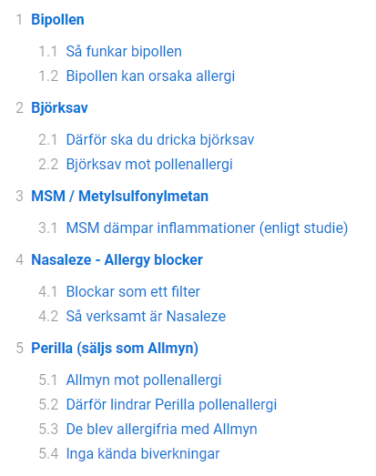

# Kirby TOC - Table Of Contents

Automatically generate a table of contents nested list of your content.

- **Version:** 0.2 beta
- **Requirement:** Kirby 3
- [Changelog](docs/changelog.md)
- [Disclaimer](https://devonera.se/docs/disclaimer/?user=jenstornell&plugin=kirby-toc)
- [Donate](https://devonera.se/docs/donate/?user=jenstornell&plugin=kirby-toc)

## Screenshot



By default the table of contents should now be visible at the top of all your pages.

## Options

```php
return [
    'jenstornell.toc.auto' => true,
    'jenstornell.toc.slug.method' => null
];
```

### auto

- When auto is `true`, the table of contents will be put on top of all pages.
- When auto is `false`, you need to add `{{ toc }}` in your content, or use a field method.

### slug.method

The built in slug method `str::slug()` converts `ä` to `ae` which is not optimal in all languages. Here you can replace the slug engine with your own.

```php
return [
    'jenstornell.toc.slug.method' => function($heading) {
        return mySuperSlugMethod($heading);
    }
];
```

## Field method

If you don't want to display the table of contents of all your pages, you can use a field method. Make sure your auto option is set to `false`.

**In your template/snippet:**

```php
<?= $page->text()->kt()->toc(); ?>
```

## Toc methods

If you want even more control, you can use the toc methods directly.

```php
$TOC = new TOC();
echo $TOC->list('
    ## Heading 2

    A paragraph

    ### Heading 3
');
```

## CSS

To make the nested table of contents list look better you need to add some counters.

**Here is how to do that in CSS:**

```html
<style>
ol {
    counter-reset: section;
    list-style-type: none;
}

li::before {
    counter-increment: section;
    content: counters(section, ".") " ";
}
</style>
```